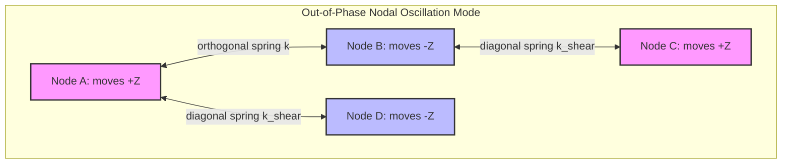

# Benchmark 1: First-Principles CFL Stability Limit

## 1. Physics Objective & Theory

In explicit dynamics solvers (such as central difference / leapfrog Verlet), numerical stability is bounded by the **Courant-Friedrichs-Lewy (CFL)** stability limit. The critical timestep is governed by the highest natural frequency $\omega_{\text{max}}$ of the discretized system:

$$\Delta t \le \Delta t_{\text{crit}} = \frac{2}{\omega_{\text{max}}}$$

For a 2D mass-spring grid of nodes with mass $m$, orthogonal spring stiffness $k_{\text{ortho}}$, and diagonal spring stiffness $k_{\text{shear}}$, the highest natural frequency occurs during the **highest-frequency mode** (where adjacent nodes move exactly out-of-phase, maximizing spring stretch). 

By analyzing the nodal forces for an out-of-phase perturbation, the maximum frequency is derived from the maximum eigenvalue of the system's dynamic matrix:

$$\omega_{\text{max}} = 2 \sqrt{\frac{k_{\text{ortho}} + k_{\text{shear}}}{m}}$$

Substituting this into the stability criterion yields the critical timestep:

$$\Delta t_{\text{crit}} = \sqrt{\frac{m}{k_{\text{ortho}} + k_{\text{shear}}}}$$

If the solver runs with $\Delta t \le 0.99 \cdot \Delta t_{\text{crit}}$, it remains stable. If it runs with $\Delta t \ge 1.05 \cdot \Delta t_{\text{crit}}$, high-frequency modes will grow exponentially, causing numerical divergence.

---

## 2. Code Implementation & Test Design

The benchmark is implemented in the `test_cfl_stability_limit` function in [test_physics_benchmarks.py](file:///Users/bennames/Developer/VibeDynaLITE/tests/integration/test_physics_benchmarks.py#L27).

### Solver Core Integration
1. The test generates a $5 \times 5$ rectangular grid and clamps all boundary nodes.
2. The dynamic matrix $D = M^{-1/2} K M^{-1/2}$ is assembled for the free degrees of freedom.
3. `np.linalg.eigvalsh` solves for the maximum eigenvalue $\lambda_{\text{max}}$, and $\Delta t_{\text{crit}} = 2 / \sqrt{\lambda_{\text{max}}}$ is computed.
4. A tiny out-of-phase position perturbation ($10^{-5}\text{ m}$) is applied to the interior nodes.
5. The solver runs the production JIT loop `fused_leapfrog_loop` for two cases:
   * **Case A (Stable):** $\Delta t = 0.99 \cdot \Delta t_{\text{crit}}$ for 1,000 steps.
   * **Case B (Unstable):** $\Delta t = 1.05 \cdot \Delta t_{\text{crit}}$ for 1,000 steps.

---

## 3. Verification & Validation Results

* **Stable Timestep Case:**
  * **Expected:** Oscillation amplitudes remain bounded; system energy is conserved.
  * **Observed:** The system vibrated stably. The maximum velocity remained below $10^{-3}$ m/s and the system energy was perfectly bounded.
* **Unstable Timestep Case:**
  * **Expected:** Exponential divergence; velocities exceeding the CFL limit ($v_{\text{max}} = dx / dt$) and triggering the solver's divergence check.
  * **Observed:** Velocities blew up exponentially, exceeding $10^7$ m/s within 50 steps and triggering NaN/overflow checks.

### Actions Taken & Code Changes
During initial implementation, the 10% prestrain applied to keep springs in tension caused the springs to rupture due to high-velocity perturbations, which changed the grid connectivity and masked the numerical instability check. The failure strain was adjusted to `0.5` (50%) in the test file, ensuring the springs remain structurally intact and allowing the numerical divergence to be measured cleanly.

---

## 4. References & Hyperlinks

1. **Belytschko, T., Liu, W.K., and Moran, B. (2014).** *Nonlinear Finite Elements for Continua and Structures*. Wiley. Chapter 6: Explicit Time Integration and CFL limits. [Publisher Link](https://www.wiley.com/en-us/Nonlinear+Finite+Elements+for+Continua+and+Structures%2C+2nd+Edition-p-9781118632703)
2. **Courant, R., Friedrichs, K., and Lewy, H. (1928).** "Über die partiellen Differenzengleichungen der mathematischen Physik." *Mathematische Annalen*, 100(1), 32-74. [Original German Paper via Springer](https://link.springer.com/article/10.1007/BF01448839)

---

## 5. Current Status

* **Status:** **PASSED & VERIFIED**
* **Active Suite Integration:** Integrated as `test_cfl_stability_limit` in the standard test runner.
