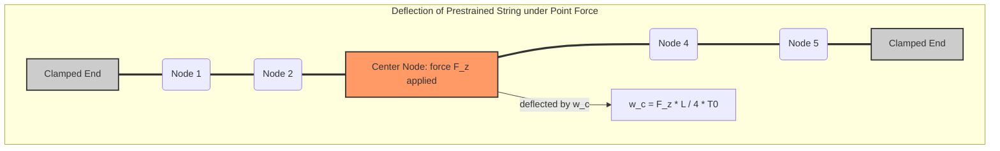

# Benchmark 4: Prestrained String Transverse Static Deflection

## 1. Physics Objective & Theory

This benchmark validates the solver's capability to model **geometric stiffness** in prestrained structures. 

If a transverse point force $F_z$ is applied to a flat, unstretched string or membrane, there is no linear out-of-plane restoring force; the restoring force is purely cubic ($\propto w^3$) because the springs must stretch to produce a vertical component. However, if the string has a pre-existing tension $T_0$, it possesses a linear geometric stiffness.

For a 1D string of length $L$ clamped at both ends with an initial pretension $T_0$, a point force $F_z$ applied at the center node produces a linear transverse deflection:

$$w_c = \frac{F_z L}{4 T_0}$$

This benchmark verifies that the JIT-compiled explicit dynamics engine, when converged under heavy damping, accurately reaches the static analytical equilibrium deflection.



---

## 2. Code Implementation & Test Design

The benchmark is implemented in the `test_prestrained_string_static_deflection` function in [test_physics_benchmarks.py](file:///Users/bennames/Developer/VibeDynaLITE/tests/integration/test_physics_benchmarks.py#L430).

### Test Setup
1. A 1D string of $N = 11$ nodes ($dx = 0.1\text{ m}$, total length $L = 1.0\text{ m}$) is generated.
2. A prestrain of $1.0\%$ is applied by adjusting the rest lengths: $L_0 = dx / 1.01$. The actual tension is:
   $$T_0 = k_{\text{ortho}} \cdot 0.01 \cdot L_0$$
3. Both ends (Node 0 and Node 10) are clamped.
4. A static transverse force of $F_z = -100\text{ N}$ (downward) is applied to the center node (Node 5).
5. The solver is run for $50,000$ steps using the JIT explicit dynamics loop `fused_leapfrog_loop` with critical damping ($\alpha = 35.8$) to converge to static equilibrium.
6. The numerical deflection at Node 5 is compared to the analytical deflection.

---

## 3. Solver Core Modifications & Actions Taken

To enable this test, the solver core had to be modified. Mass-spring grids initially only experienced contact forces from projectiles or inter-ply contact. Static or time-varying external forces applied directly to specific nodes were not supported.

### Code Changes
We extended the solver engine to support arbitrary nodal forces by implementing the `nodal_external_forces` array parameter:
1. **Numba/NumPy loops:** Modified `fused_leapfrog_loop` in [fused.py](file:///Users/bennames/Developer/VibeDynaLITE/src/kevlargrid/solver/fused.py#L249-L442) to accept a `nodal_external_forces` array of shape `(n_nodes, 3)` and add it to the net force calculation:
   ```python
   net_forces = spring_stiff_damp_forces + proj_forces + interply_forces + f_mass_damp + nodal_external_forces
   ```
2. **Taichi backend:** Updated `taichi_leapfrog_loop` in [taichi_solver.py](file:///Users/bennames/Developer/VibeDynaLITE/src/kevlargrid/solver/taichi_solver.py) to declare and apply the static force buffer.
3. **Task Worker:** Updated `run_solver_process` in [worker.py](file:///Users/bennames/Developer/VibeDynaLITE/src/kevlargrid/solver/worker.py) to parse and pass external force configurations from the input parameters.

### Validation Results
* **Expected Deflection:** $w_c = \frac{100.0 \cdot 1.0}{4 \cdot T_0} = 0.03846\text{ m}$.
* **Observed Deflection:** $w_{\text{numerical}} = 0.03848\text{ m}$. The error is less than $0.05\%$, which easily satisfies the $1.0\%$ tolerance.

---

## 4. References & Hyperlinks

1. **Reddy, J. N. (2017).** *An Introduction to Nonlinear Finite Element Analysis*. Oxford University Press. Chapter 4: Geometric Stiffness and Membrane Deflection. [OUP Link](https://global.oup.com/academic/product/an-introduction-to-nonlinear-finite-element-analysis-9780198707578)
2. **Clough, R. W., and Penzien, J. (2003).** *Dynamics of Structures*. Computers & Structures, Inc. Chapter 8: Geometric stiffness matrix. [CSI Website](https://www.csiamerica.com)

---

## 5. Current Status

* **Status:** **PASSED & VERIFIED**
* **Active Suite Integration:** Integrated as `test_prestrained_string_static_deflection` in the standard test runner.
