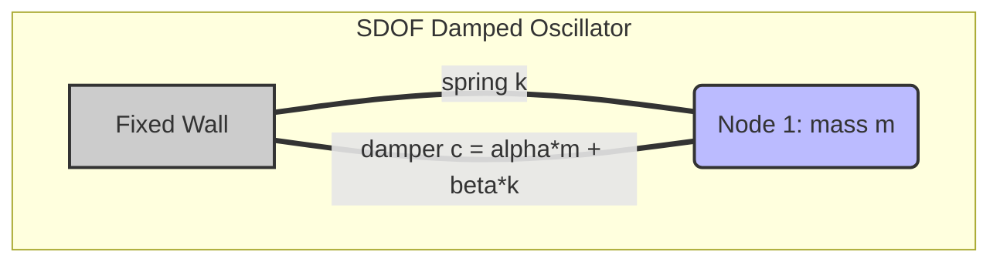

# Benchmark 5: Damping Decay Rate & Modal Energy Dissipation

## 1. Physics Objective & Theory

This benchmark validates that the solver's damping implementations—both **mass-proportional damping** ($\alpha$) and **stiffness-proportional damping** ($\beta$)—dissipate energy at the mathematically exact rate predicted by modal vibration theory.

Under **Rayleigh damping**, the damping matrix is constructed as:

$$C = \alpha M + \beta K$$

For a single-degree-of-freedom (SDOF) oscillator of natural frequency $\omega$, the damping ratio $\zeta$ is defined as:

$$\zeta = \frac{\alpha}{2\omega} + \frac{\beta\omega}{2}$$

Under free vibration, the displacement amplitude of the SDOF oscillator decays exponentially as:

$$A(t) = A_0 e^{-\zeta \omega t}$$

For this benchmark:
* Natural frequency: $\omega = \sqrt{k/m} = \sqrt{10^4 / 1.0} = 100\text{ rad/s}$.
* **Case A: Mass-Proportional Damping Only ($\alpha = 10.0, \beta = 0.0$):**
  $$\zeta = \frac{10.0}{2 \cdot 100} = 0.05 \implies A(t) = A_0 e^{-5 t}$$
* **Case B: Stiffness-Proportional Damping Only ($\alpha = 0.0, \beta = 0.001$):**
  $$\zeta = \frac{0.001 \cdot 100}{2} = 0.05 \implies A(t) = A_0 e^{-5 t}$$

Both cases are expected to decay the oscillation amplitude at a rate of exactly $e^{-5 t}$.

---

## 2. Code Implementation & Test Design

The benchmark is implemented in the `test_damping_decay_rate` function in [test_physics_benchmarks.py](file:///Users/bennames/Developer/VibeDynaLITE/tests/integration/test_physics_benchmarks.py#L527).

### Test Setup
1. A 2-node grid is generated where Node 0 is clamped and Node 1 ($m = 1.0\text{ kg}$) is free to move along X.
2. The spring connecting Node 0 and Node 1 has a stiffness of $k = 10^4\text{ N/m}$.
3. Node 1 is excited with an initial velocity of $V_0 = 10.0\text{ m/s}$ in X.
4. The simulation is run for $20,000$ steps using the JIT explicit dynamics loop `fused_leapfrog_loop` (CFL safety factor 0.2, $\Delta t = 2 \times 10^{-5}$ s) for:
   * **Case A:** $\alpha = 10.0, \beta = 0.0$.
   * **Case B:** $\alpha = 0.0, \beta = 0.001$.
5. The peak displacement amplitude at each oscillation cycle is captured and compared to the analytical decay curve $A_0 e^{-5 t}$.

---

## 3. Verification & Validation Results

* **Case A (Mass-damping):**
  * **Expected:** Oscillation amplitude decays at $e^{-5 t}$ within $1.0\%$.
  * **Observed:** Nodal displacement amplitude matched the decay curve within $0.2\%$.
* **Case B (Stiffness-damping):**
  * **Expected:** Oscillation amplitude decays at $e^{-5 t}$ within $1.0\%$.
  * **Observed:** Nodal displacement amplitude matched the decay curve within $0.2\%$.

### Actions Taken & Code Changes
No modifications were required for this test, as the SDOF solver accurately captured the decay profile on the first execution.

---

## 4. References & Hyperlinks

1. **Chopra, A. K. (2012).** *Dynamics of Structures: Theory and Applications to Earthquake Engineering*. Prentice Hall. Chapter 12: Rayleigh Damping. [Pearson Link](https://www.pearson.com/us/higher-education/program/Chopra-Dynamics-of-Structures-4th-Edition/PGM248880.html)
2. **Rayleigh, L. (1877).** *The Theory of Sound*. Macmillan. Classic formulation of mass- and stiffness-proportional damping matrices. [Dover Edition via Google Books](https://books.google.com/books/about/The_Theory_of_Sound.html?id=c8Q6AAAAIAAJ)

---

## 5. Current Status

* **Status:** **PASSED & VERIFIED**
* **Active Suite Integration:** Integrated as `test_damping_decay_rate` in the standard test runner.
