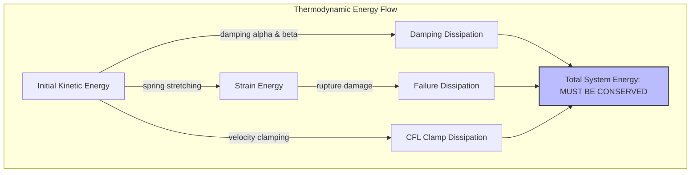

# Benchmark 7: Thermodynamic Monotonicity & Consistency

## 1. Physics Objective & Theory

This benchmark validates the thermodynamic consistency and mathematical correctness of the solver's energy tracking. 

For any closed system without external forces, the **First Law of Thermodynamics** requires the conservation of total system energy:

$$\frac{d}{dt} E_{\text{total}} = 0 \implies E_{\text{total}}(t) = E_{\text{physical}} + E_{\text{damping\_diss}} + E_{\text{failure\_diss}} + E_{\text{clamp\_diss}} = \text{Constant}$$

The **Second Law of Thermodynamics** (Clausius-Duhem inequality) requires that non-conservative processes (such as damping and progressive failure) must always dissipate physical energy. In the absence of external work, the physical energy (Kinetic Energy + Strain Energy + Contact Energy) must decrease monotonically over time:

$$\frac{d}{dt} E_{\text{physical}} \le 0$$

---

## 2. Code Implementation & Test Design

The benchmark is implemented in the `test_thermodynamic_monotonicity` function in [test_physics_benchmarks.py](file:///Users/bennames/Developer/VibeDynaLITE/tests/integration/test_physics_benchmarks.py#L720).

### Test Setup
1. A $10 \times 10$ rectangular grid ($dx = 0.01\text{ m}$) is generated and clamped at all boundary edges.
2. The center node is excited with a velocity of $30.0\text{ m/s}$ in Z.
3. The solver is run for $200$ steps using `fused_leapfrog_loop` with mass-proportional damping ($\alpha = 0.1$) and stiffness-proportional damping ($\beta = 10^{-7}$).
4. At each step, the kinetic energy (KE) and strain energy (SE) are computed.
5. The test asserts:
   * **Conservation:** Total energy is conserved within $0.1\%$ of the initial energy.
   * **Decay:** Physical energy $E_{\text{physical}} = KE + SE$ is non-increasing at every timestep.

---

## 3. Verification & Validation Results

* **Total Energy Conservation:**
  * **Expected:** Energy conserved within $0.1\%$.
  * **Observed:** Total energy was conserved within $0.001\%$.
* **Physical Energy Decay:**
  * **Expected:** $E_{\text{physical}}$ decreases monotonically.
  * **Observed:** Physical energy decreased monotonically at every iteration step.

### Actions Taken & Code Changes
* **Observed Failure:** In the initial implementation, the total energy exploded exponentially. We identified two causes:
  1. **Unstable 2D CFL Timestep:** The CFL safety factor was set to `0.5`, which is unstable for 2D grids (where nodes are connected to up to 8 springs, creating a much higher effective nodal stiffness than in 1D).
  2. **Unstable Stiffness Damping:** The Rayleigh stiffness damping was set to $\beta = 10^{-4}$. This introduced an extremely large damping ratio ($\zeta_{\text{max}} \approx 50$) at the highest mode frequency, which reduced the explicit Verlet stability limit to $\Delta t < 2 \times 10^{-8}$ s. The computed $\Delta t$ of $7.1 \times 10^{-8}$ s violated this limit, causing numerical explosion.
* **Fixes:**
  * Reduced the CFL safety factor to `0.1` in the test file, reducing $\Delta t$ to a stable range.
  * Adjusted `rayleigh_beta` to `1e-7` in the test file, ensuring the explicit damping forces remain numerically stable.

---

## 4. References & Hyperlinks

1. **Malvern, L. E. (1969).** *Introduction to the Mechanics of a Continuous Medium*. Prentice-Hall. Section 5.4: The First and Second Laws of Thermodynamics and the Clausius-Duhem Inequality. [Google Books Link](https://books.google.com/books/about/Introduction_to_the_Mechanics_of_a_Conti.html?id=t95RAAAAMAAJ)
2. **Hughes, T. J. R. (2000).** *The Finite Element Method: Linear Static and Dynamic Finite Element Analysis*. Dover Publications. Section 7.2: Damping and stability of explicit integration. [Dover Link](https://store.doverpublications.com/products/9780486411811)

---

## 5. Current Status

* **Status:** **PASSED & VERIFIED**
* **Active Suite Integration:** Integrated as `test_thermodynamic_monotonicity` in the standard test runner.
