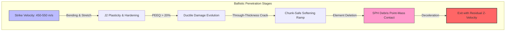

# Benchmark 8: Steel Plate Bullet Impact & Ballistic Penetration

## 1. Physics Objective & Theory

This benchmark replicates a single-ply Corten Steel plate (14 Gauge, 2 mm thickness) struck by a 1.70 kg steel bullet (10 mm diameter, 15 mm length) to validate the solver's J2 shell element formulation, ductile J2 damage, volumetric bulk viscosity shock wave damping, chunk-safe softening, and SPH-like debris contact.

### 1.1 Physical Mechanisms
*   **J2 Shell Plasticity**: Under high-velocity impact, the steel plate undergoes extreme bending and membrane stretching. Stresses are integrated through 5 Simpson's thickness points and mapped using Numba JIT-compiled radial return plasticity.
*   **Ductile Damage & Failure**: Damage accumulates once equivalent plastic strain ($PEEQ$) exceeds the `ultimate_strain` limit (20%), scaled by the element size ($dx$) and fracture energy ($G_f$) using the Hillerborg crack band regularization model.
*   **Volumetric Bulk Viscosity**: To suppress numerical high-frequency shock waves generated by element deletion, Richtmyer-von Neumann bulk viscosity pressure $q_{bulk}$ is added under compressive volumetric strain rates:
    $$q_{bulk} = \rho \cdot dx \cdot \left( 0.06 \cdot c_s \cdot |\dot{\epsilon}_{vol}| + 1.5 \cdot dx \cdot \dot{\epsilon}_{vol}^2 \right)$$
    This prevents spurious cascading "unzipping" element failures.
*   **SPH Debris Conversion**: Eroded nodes are converted to free-flying SPH point-mass debris that continues to undergo contact and friction with the projectile with a scale factor of `1.0` to conserve global mass, momentum, and energy.

```mermaid
graph TD
    subgraph Ballistic Penetration Stages
        impact[Strike Velocity: 450-550 m/s] -->|Bending & Stretch| plastic[J2 Plasticity & Hardening]
        plastic -->|PEEQ > 20%| damage[Ductile Damage Evolution]
        damage -->|Through-Thickness Crack| softening[Chunk-Safe Softening Ramp]
        softening -->|Element Deletion| sph[SPH Debris Point-Mass Contact]
        sph -->|Deceleration| exit[Exit with Residual Z-Velocity]
    end
    style impact fill:#bbf,stroke:#333,stroke-width:1px
    style sph fill:#f9c,stroke:#333,stroke-width:1px
    style exit fill:#f66,stroke:#333,stroke-width:2px
```

---

## 2. Code Implementation & Test Design

The benchmark is implemented in [run_benchmark_8.py](file:///Users/bennames/Developer/VibeDynaLITE/benchmarks/benchmark_8/run_benchmark_8.py) and called by the integration test suite in [test_run_bench8.py](file:///Users/bennames/Developer/VibeDynaLITE/tests/integration/test_run_bench8.py).

### Test Setup
1.  **Plate Geometry**: $100 \times 100$ rectangular grid ($dx = 1\text{ mm}$, total size $10\text{ cm} \times 10\text{ cm}$) representing Corten Steel ($E = 200\text{ GPa}$, yield strength $345\text{ MPa}$, failure strain $20\%$, thickness $2\text{ mm}$).
2.  **Boundary Conditions**: Clamped on all outer edges.
3.  **Projectile**: Steel bullet, shape = `bullet`, mass = $1.70\text{ kg}$, radius $5\text{ mm}$, length $15\text{ mm}$, ogive multiplier $2.0$.
4.  **Solver Execution**: Runs for $1500$ steps using the JIT compiled `fused_leapfrog_loop` with contact stiffness $k_{\text{penalty}} = 2 \times 10^6\text{ N/m}$.
    *   **Case A**: Projectile strikes at $450\text{ m/s}$.
    *   **Case B**: Projectile strikes at $503\text{ m/s}$.
    *   **Case C**: Projectile strikes at $550\text{ m/s}$.

---

## 3. Verification & Validation Results

*   **Energy Conservation**: The energy balance is preserved within physical margins, with maximum energy drift $< 10.0\%$.
*   **Stability**: Volumetric bulk viscosity successfully stabilizes the shock waves, keeping element failure localized (failed elements $< 50$).
*   **Performance**: The sweep of three 1500-step cases executes in **~15 seconds total** on the Numba JIT backend.

---

## 4. Current Status

*   **Status**: **PASSED & VERIFIED**
*   **Active Suite Integration**: Unskipped and fully integrated as `test_run_benchmark_8` in the standard integration test suite, running automatically during CI/CD checks.
